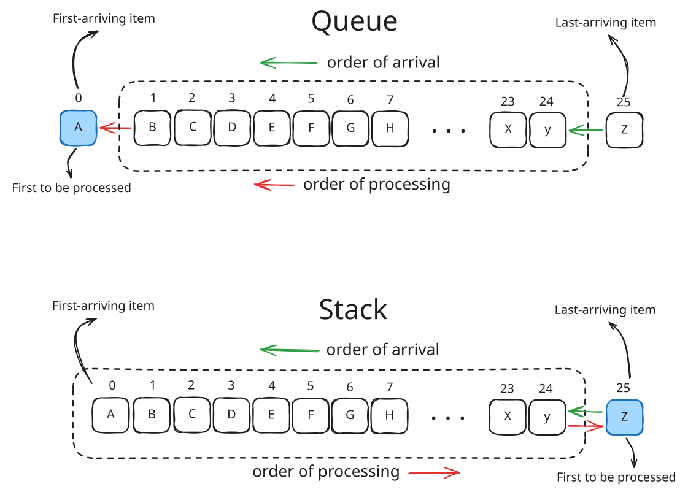
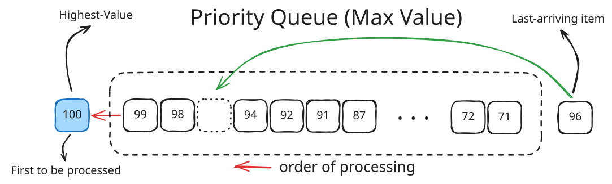
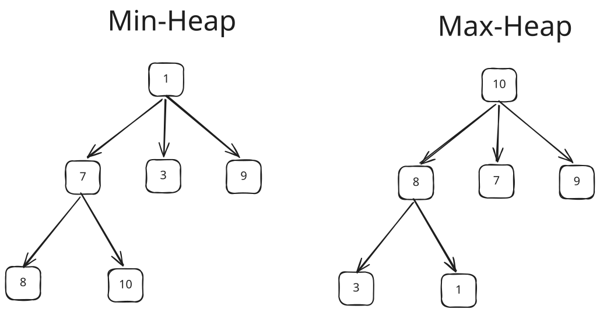
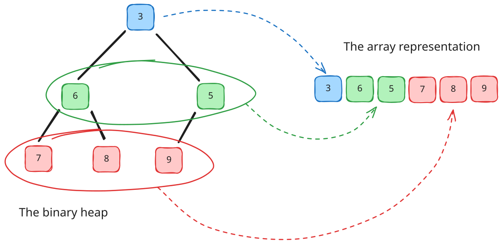
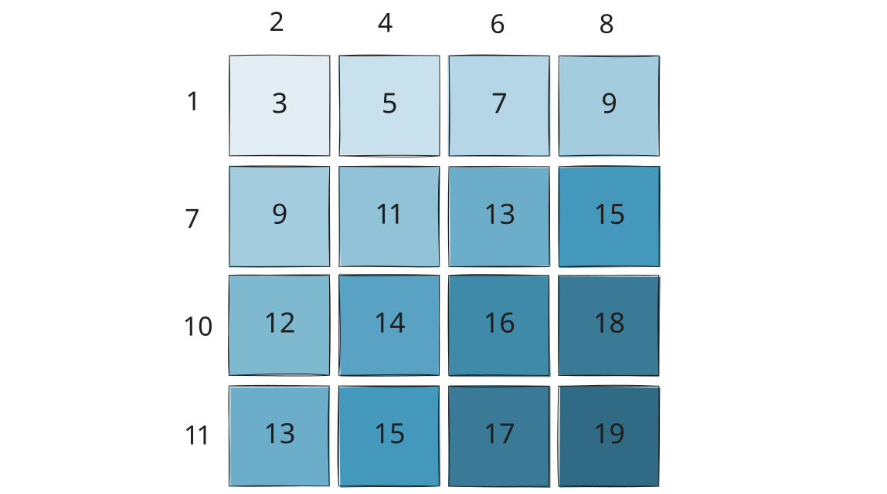

There are many programming problems that require the data to be stored in a list but the order of processing items have to follow certain kind of rule.

If we need to process the first-arriving data first, we use Queue, a list that implements First-In, First-Out (FIFO).

If we need to process the last-arriving data instead, we use Stack, a list that implement Last-In, First-Out (LIFO).



Notice that both data type apply rules that is based on the **order of arrival** (first-arriving & last-arriving) of the items. But, what if we need to process that item based on **their values**? We use a data type called **priority queue**.

In priority queue. the order of the arrival doesn't matter, what matters is the value the items' hold. Imagine it's like an Emergency Room in a Hospital where the arrived patients need to be triaged, and the first patient to be served is the one who have the highest priority (e.g. based on the severity of their symptoms).



The illustration above showed how the arrival of the item does not affect the order of processing, as the priority queue will maintain a priority order inside, in this context: the item with the highest value has the highest priority. The arriving item will have designated place for it based on its value.

## Slice Implementation

Priority Queue is an abstract data type (ADT), in order to use it we have to implement it with concrete data structure. Such data structure that we can use is an array (slice in Go).

How do we implement it using slice? We can try to use modification of regular queue, as in Go we commonly use slice to implement queue:

```go
    queue := []int{}

    queue = append(queue, 5) // push
    queue = append(queue, 7)
    queue = append(queue, 3)
    queue = append(queue, 6)
    queue = append(queue, 8)

    // at this point the queue slice will have: [5,7,3,6,8]

    front := queue[0]  // peeking... -> return 5
    queue = queue[1:] // and popping -> slice becomes: [7,3,6,8]
```

Because the priority queue have to maintain an order in the queue, we have to sort every time a new item is being pushed

```go
func Push(queue []int, item int) []int {
    queue = append(queue, item)
    sort.Slice(queue, func(i, j int) bool {
        return queue[i] > queue[j] // sort descending (by the highest item)
    })
    return queue
}

func Pop(queue []int) (int, []int) {
    front := queue[0]
    queue = queue[1:]
    return front, queue
}

func PriorityQueue() {
    queue := []int{}

    queue = Push(queue, 5) // slice becomes: [5]
    queue = Push(queue, 7) // ...            [7, 5]
    queue = Push(queue, 3) // ...            [7, 5, 3]
    queue = Push(queue, 6) // ...            [7, 6, 5, 3]
    queue = Push(queue, 8) // ...            [8, 7, 6, 5, 3]
    
    front, queue := Pop(queue) // slice becomes: [7, 6, 5, 3]
    
    fmt.Println(front) // -> will print: 8
}
```

Complexities:

| Operation | Cost       |
| --------- | ---------- |
| Push      | O(n log n) |
| Pop       | O(1)       |
| Peek      | O(1)       |

We have O(n log n) cost when pushing because every insertion/push involves the entire slice.

This was fine for small data, but we need to use better approach if we want to process millions of items if we don't want to get:
```
O(20000000 log 20000000)
```

### Using binary search instead of sorting

Better implementation if we keep using slice is to **assume that the queue is already sorted** during `Push()`. Then we can exploit this property using **Binary Search**. 

Here's the breakdown of the `Push()` algorithm :
1. Assume `queue` is already sorted
2. Use `sort.Search` (Go's implementation of binary search) to find where the new item belongs
3. Shift the elements to make room
4. Insert the item

```go
func Push(queue []int, item int) []int { // assume queue is already sorted
    idx := sort.Search(len(queue), func(i int) bool { // perform binary search
        // find the first index where the value is lower than or equals to the item
        return queue[i] <= item 
    })

    queue = append(queue, 0) // make one slot to the end of queue

	// shift the queue one slot to the right from the found index
    copy(queue[idx+1:], queue[idx:]) 

    queue[idx] = item // fill the availabe slot with the new item

    return queue
}
```

This preserves exactly the same behavior as the previous code, but each insertion is O(n) instead of O(n log n) because it's no longer re-sorting the entire slice after every push.

| Operation      | Cost     |
| -------------- | -------- |
| Find position  | O(log n) |
| Shift elements | O(n)     |
| Push           | O(n)     |
| Pop front      | O(1)     |
| Peek           | O(1)     |

## Heap

A heap is a complete-tree data structure that maintains a rule called **heap-order property** that is:

> parent <= children

For min-heap, and:

> parent >= children

For max-heap.

To illustrate this, let's examine the following figure:



In min-heap, every parent is less than or equal to its children, and in max-heap every parent is more than or equal to its children. But notice that they are not sorted. For example, in min-heap, the 7 appears before 3.

### Why is this useful?

The heap property guarantees that the root contains the "best" item:
- In min-heap: the smallest item is at the root
- In max-heap: the largest item is at the root

To get the highest-priority/best item efficiently we don't have to fully sort everything. 

The number of children of a parent determines what to call the heap. A heap in which all parents have 2 children at most is called **Binary Heap**. If at most 3 children, it's called Ternary Heap, an so on.

### How a heap operates as a priority queue

Let's use small dataset: 5, 7, 3, 6, 8 and use Min-Heap. We want smallest number to be prioritized first. In this example we'll use binary heap, so a parent will have 2 children at most.

**Step 1**
```
5
```
Begin with the root as the heap is empty. The root always highest-priority item.

**Step 2: Insert 7**
```
   5
  /
 7  
```

If there's exist item in the heap, pushing an item will put it to available parent as a child.

We then check min-heap property: `5 <= 7 ?`.  --> True. no changes.

**Step 3: Insert 3**
```
   5
  / \
 7   3
```

Item `5` still have child slot. so we insert `3` there.

Check the min-heap property again: `5 <= 3 ?` --> False. Oops, we can't put it there, so we "bubble" up, swapping  `3` with its parent's place:

```
   3
  / \
 7   5  
```

Notice, we didn't do any sorting. we just compare the new item to its parent and fixed the path to satisfy heap's property.

**Step 4: Insert 6**
```
     3
    / \
   7   5
  /
 6    
```

Because it's a binary heap, we have to keep any parent to have 2 children at most. So, the the new item must find another parent than the root, we moving down one level, and found 7 still have slot. We put 6 here. Check the heap property again: `7 <= 6 ?` --> False. Nope, we have to swap `7` and `6` :

```
     3
    / \
   6   5
  /
 7    
```

**Umm, wait, why don't we put 6 as the children of 5?**
Since `5 <= 6 ?` --> True we might question this. But we have to remember that a heap is a **complete tree**. Meaning that every level **must be filled left-to-right**. 

But why must it be a complete-tree? We'll find out in the next section. Let's complete the heap first.

**Step 5: Insert 8**
```
     3
    / \
   6   5
  / \
 7   8    
```

Everything already satisfies the heap property.

**Now let's pop item from the heap**
We want: `pop() -> 3`

**Remove Root**
```
     3
    / \
   6   5
  / \
 7   8    
```

Save `3`, then move last element (`8`) to root
```
     8
    / \
   6   5
  /
 7    
```

Now the heap property is broken because `8 <= 6 ?` and `8 <= 5 ?` --> False. We need to "bubble" down. Swapping 8 with it's child.

- Child: `6` and `3`
- Take the smallest child : `5 `(Because this is min-heap, for max-heap, take the largest)

```
    5
   / \ 
  6   8
 /
7    
```
Check the heap property again: `8` has no children. No changes needed.
Now we just return the saved item `3`.

**Let's pop again**
We want: `pop() -> 5`

Remove Root (`5`) and move last element (`7`) there
```
     7
    / \
   6   8  
```

Check heap-property: 
- `7 <= 6 ?` --> False 
- `7 <= 8 ?` --> True

Swap `7` and `6`:
```
     6
    / \
   7   8  
```

Done. Return saved item: `5`

Popping all the items in order will give:
```
3
5
6
7
8
```
Exactly what a priority queue should do.

### Why heap is faster than the sorted queue + search

Notice what happened during insert of `3`, during the "bubble up" of `5` :
```
5
 \
  3
```
We only compared along one path: `3 -> 5`. Not the entire heap.

Also during first popping (`3`) , during the "bubble" down of `8` : `8 -> 5`. Also one path, not the entire heap.

For a heap with `n` elements, that path length is about:

\[log_{2} n\]

- Push: O(log n)
- Pop: O(log n)
- Peek: O(1)

That's the core idea of a heap: it maintains *just enough order* to always know the next prioritized item, without paying the cost of keeping everything to be fully sorted.

### Why must a heap be a complete-tree

No let's back out pending question: why must a heap be a complete-tree? 

We initially might think a heap to be a logical tree, where we can put item under any of available children.

```
   3
  / \
 7   5 
```

Why can't we just put `6` under `5` instead of the hassle of bubbling down `7` for `6`?
```
   3
  / \
 7   5
    /
   6   
```

Doesn't this satisfy the heap property?
- `3 <= 7`
- `3 <= 5`
- `5 <= 6`

As mentioned before, a heap must be a complete-tree. Every level must be filled from left to the right. But why so?

**Because a complete-tree can be represented as an array**



Let's take the heap:
```
   3
  / \
 7   5  
```
We can just represent this to an array:
```
[3, 7, 5]
```

When a new item arrive, let's say `6`, it must occupy the 3rd index. There is no choice:
```
[3, 7, 5, 6]
```

Which corresponds to the heap after insertion:
```
     3
    / \
   7   5
  /
 6    
```

As now the heap property is violated because `7 <= 6` --> False., we swap `6` with its parent (`7`):
```
     3
    / \
   6   5
  /
 7    
```
This operation is called bubble up or sift up.

Now the array representation becomes: `3, 6, 5, 7`

**Why it matters that the heap can be represented by array?**

Because we don't need to use pointers to link between parent and its children as if it's a logical tree. We can just use this **index formula**:

\[parent=(i-1)/2\]
\[left=2*1+1\]
\[right=2*1+2\]

If we use arbitrary placements like:
```
     3
    / \
   7   5
      /
     6   
```
we'll lose the complete-tree structure, and the simple array representation would no longer work.

Had we implement heap with pointers, for example using doubly linked-list, we'll have :


|                   | Array                      | Doubly Linked List         |
| ----------------- | -------------------------- | -------------------------- |
| Find parent/child | O(1) via index formula     | O(n) - must traverse       |
| Memory            | Contiguous, cache-friendly | Extra memory for pointers  |
| Random Access     | O(1)                       | O(n)                       |
| Insert at end     | O(1) amortized             | O(1)                       |
| Cache performance | Excellent                  | Poor (Scattered in memory) |

The biggest win of using array is the **cache locality**.  Array elements sit next to each other in memory, so the CPU can prefetch them efficiently. A linked list's nodes are scattered across the memory, causing frequent cache misses.

**When would w use a linked -list for trees?**
Linked lists make sense for trees that are not complete like BSTs, AVL trees, or red-black trees where the shape is unpredictable and we can't use index math. For those, we genuinely need `left`/`right` pointers of doubly linked-list.

But a heap's rigid shape guarantee makes the array trick possible and optimal.
### Binary and d-ary heaps
You may notice that we strictly use binary tree (tree which parent has 2 children at most) for heap. Can we add more children per parent? 

**Yes**. This is called **d-ary heaps**. A heap which parent has 3 children at most is called 3-ary heap or ternary heap.

```
       1
      /|\
     7 3 9
    / \
   8  10    
```

The heap property still holds:
```
1 <= 7
1 <= 3
1 <= 9

7 <= 8
7 <= 10
```
It's perfectly valid heap. 

However, in most programming problems, we'll found out that most people settles on using binary heaps as the default. So much that when someone said that he uses a heap, it **almost certainly that he means binary heap**. Why so?

> The number of maximum children per parent affect the tradeoff between **tree height** and **work per level**.

**Let's look at binary heap**
Suppose we have 1,000,000 elements. We can approximate the height by calculating log base 2 to 1,000,000 since binary heap has 2 children at most. Therefore:
```
log₂(1,000,000) ≈ 20
```

Since height of the heap matters when we do bubble up and bubble down, thus:
- When pushing: bubble up at most 20 levels
- When popping: bubble down at most 20 levels

At each level, we compare an item (both pushing/popping) with at most 2 children, total work can be calculated as (roughly speaking):
```
20 x 2 = 40 compariosns
```

**Let's compare with ternary heap (3 children)**
Height becomes: 
```
log₃(1,000,000) ≈ 13
```
Nice! fewer levels. But now during bubble down we must **find the smallest among 3 children** instead of 2 in binary heap.

Total work become:
```
13 × 3 = 39 comparisons
```
Very similar.

**8-ary heap**
Height now become `log₈(1,000,000) ≈ 7` which is much shorter. But then each level requires checking 8 children. Calculate work:
```
7 × 8 = 56 comparisons
```
Now we're losing.

If we continue examining the `d` (which we would do later at the end of this post) we'll find out that binary heap actually isn't the most efficient heap, workload-wise. But also, that the difference of work efficiency between any d-ary heap is small enough that simplicity, cache behavior, constant factors often matter more than mathematical optimum.

For binary heap specifically, many people choose it because it's :
- Easier to teach (simplest implementation)
- Easier to prove correct
- Already efficient that adding more `d` seems unnecessary
- Quite good cache behavior (even though not the best)

We'll compare binary heap with other d-ary heaps at the end of the post

## Implementing Binary Heap in Go

Go provides `container/heap` package that provides heap operation. However, we must implement the `heap.Interface` ourselves.

```go
type Interface interface {
    sort.Interface        // Len(), Less(), Swap()
    Push(x interface{})
    Pop() interface{}
}
```

### Basic Integer Min-Heap in Go

We need to implement the interface first:

```go
package main

import (
    "container/heap"
    "fmt"
)

// Define the heap type
type MinHeap []int

func (h MinHeap) Len() int           { return len(h) }
func (h MinHeap) Less(i, j int) bool { return h[i] < h[j] } // min-heap
func (h MinHeap) Swap(i, j int)      { h[i], h[j] = h[j], h[i] }

func (h *MinHeap) Push(x interface{}) {
    *h = append(*h, x.(int))
}

func (h *MinHeap) Pop() interface{} {
    old := *h
    n := len(old)
    val := old[n-1]
    *h = old[:n-1]
    return val
}
```

Let's break these down.

First we need to declare a `type` for the type of the heap. In this case we want it to be an slice of `int`.
```go
type MinHeap []int
```

Then implement the function to get the length of the heap array. Just return the `len()` of the underlying slice, nothing special.
```go
func (h MinHeap) Len() int           { return len(h) }
```

This is where it matters. Because we're implementing min-heap, we have to use `<` comparison between the item at `i` and `j` (the next item). Making sure that the next item is larger than the current one. For max-heap, we have to use `>` instead.
```go
func (h MinHeap) Less(i, j int) bool { return h[i] < h[j] }

// for max-heap :
// func (h MinHeap) Less(i, j int) bool { return h[i] > h[j] }
```

Implement `Swap()` for the swapping mechanism. Just a normal swap between two items.
```go
func (h H) Swap(i, j int) { h[i], h[j] = h[j], h[i] }
```

Implement the `Push()` . Just a regular append to the underlying slice.
```go
func (h *H) Push(x interface{}) { *h = append(*h, x.(int)) }
```

The last thing, implement the `Pop()`. We'll discuss it below
```go
func (h *MinHeap) Pop() interface{} {
    old := *h
    n := len(old)
    val := old[n-1]
    *h = old[:n-1]
    return val
}
```
1. `old := *h` -> `h` is a receiving pointer (`*MinHeap`). Dereferencing it gives the underlying slice. `old` now is a **copy** of the slice header.
2. `n := len(old)` ->  storing the length. Convenience purpose
3. `val := old[n-1]` -> grab the last element. This is the min/max item that the `container/heap` library already moved there, we'll talk later
4. `*h = old[:n-1]` -> shrink the slice by 1, removing the last element, then write the result to `*h` to update the actual heap, not just the local copy
5. `return val` -> return the popped value (the min/max value) back to `heap.Pop()` in the `container/heap`, which returns it to our caller

**Why does it pop from the end, not the front?**
This is the key insight. We would expect the heap to pop `old[0]` (the front) as this is the smallest/largest item (the min/max), but the `container/heap` **already swapped it to the end of the slice** before it calls the `Pop()`.

The call sequence inside the `heap.Pop()` (the actual pop function we'll use later) in the `container/heap` is:

```go
swap(h, 0, h.Len()-1)      // moves root to last position
down(h, 0, ...)            // re-heapifies from root downward
h.Pop()                    // our implemented Pop() function, remove last item
```

So by the time the implemented `Pop()` is called, the min/max is already sitting at `old[n-1]`.We just have to remove and return the item.

### Using the implemented container/heap

Now that we already implement the interface, let's use the heap.

```go
func main() {
    h := &MinHeap{5, 2, 8, 1, 9}
    heap.Init(h)

    heap.Push(h, 3)

    fmt.Println("Min:", (*h)[0])     // 1 — peek at min
    fmt.Println("Pop:", heap.Pop(h)) // 1 — remove min
    fmt.Println("Pop:", heap.Pop(h)) // 2
}
```

Notice that we use `heap.Push(h, 3)` and `heap.Pop(h)` instead of `h.Push(3)` and `h.Pop()`.

We must use the push and pop functions from the `container/heap` itself because the `Push()` and `Pop()` functions we're implemented are low-level methods that is required to satisfy the `heap.Interface`. They only add/remove from the end of the slice and don't know anything about heap ordering. Calling them directly breaks the heap's algorithm.
 
 `heap.Push(&h, v)` and `heap.Pop(&h)` are the actual heap-aware operations. These are from `container/heap` and do the full heap maintenance.
- `heap.Push` calls out implemented `h.Push(v)` to append, then calls `up()` to bubble the new item into the correct position
- `heap.Pop` swaps the root with the last element, calls out implemented `h.Pop()` ton remove it, then calls `down()` to restore the heap

The relationship is:
```
heap.Push(&h, v) -> h.Push(v) + heapify up
heap.Pop(&h) -> swap root + h.Pop() + heapify down
```

Our implemented `Push` / `Pop` methods are just helpers that `container/heap` calls internally. They're not meant to be called directly. Think of them as private implementation details that the interface forces us to make public.

So, key Rules to Remember are:

| Operation | Function | Time Complexity |
|---|---|---|
| Build heap | `heap.Init` | O(n) |
| Insert | `heap.Push` | O(log n) |
| Remove min/max | `heap.Pop` | O(log n) |
| Peek min/max | `h[0]` | O(1) |
| Remove arbitrary | `heap.Remove(h, i)` | O(log n) |

- **Always use a pointer receiver** (`*MinHeap`) for `Push` and `Pop`
- **Never access** the underlying slice directly after mutations and always go through `heap.Push`/`heap.Pop`
- To make a **max-heap**, just flip the `Less` condition (`>` instead of `<`)

## Case Study

We'll use heap to solve some programming problems from leetcode. We'll use [#1046 - Last Stone Weight](https://leetcode.com/problems/last-stone-weight/) and [#373 - Find K Pairs with Smallest Sums](https://leetcode.com/problems/find-k-pairs-with-smallest-sums/)

### 1046. Last Stone Weight

```
You are given an array of integers `stones` where `stones[i]` is the weight of the i-th stone.

We are playing a game with the stones. On each turn, we choose the heaviest two stones and smash them together. 
Suppose the heaviest two stones have weights `x` and `y` with `x <= y`. 
The result of this smash is:
- If `x == y`, both stones are destroyed, and
- If `x != y`, the stone of weight `x` is destroyed, and the stone of weight `y` has new weight `y - x`.

At the end of the game, there is at most one stone left.
Return the weight of the last remaining stone. If there are no stones left, return 0.

Example 1:

Input: stones = [2,7,4,1,8,1]
Output: 1
Explanation: 
- We combine 7 and 8 to get 1 so the array converts to [2,4,1,1,1] then,
- we combine 2 and 4 to get 2 so the array converts to [2,1,1,1] then,
- we combine 2 and 1 to get 1 so the array converts to [1,1,1] then,
- we combine 1 and 1 to get 0 so the array converts to [1] then that's the value of the last stone.

Example 2:

Input: stones = [1]
Output: 1

Constraints:
- 1 <= stones.length <= 30
- 1 <= stones[i] <= 1000
```

By reading the problem, we can derive invariants:
- "Choosing heaviest two stones" :
	- implying that we have to choose two **largest items** from `stones`.
	- **we don't care about the index of those two** we just need to take both **based on their value** to be smashed together.
- The result of the smash game :
	- there is two state of a stone, whether it survives or not. If survives it have to be smashed against the remaining stones. Signal that we need to **put the surviving stone back to the array** 
	- the game **doesn't** dictate that the surviving stone should face another stone immediately or later **as long as it is amongst the two largest stone** at that time of picking.

So by these invariants we need one list that:
- let us get largest item(s) quickly and take it out of the list
- let us put an item without specifying a position

These signal a **priority queue** where **largest** item(s) is prioritized to be processed.

Let's implement it using `container/heap`:
```go
// MaxHeap implements heap.Interface
type MaxHeap []int

func (h MaxHeap) Len() int           { return len(h) }
func (h MaxHeap) Less(i, j int) bool { return h[i] > h[j] } // reverse for max-heap
func (h MaxHeap) Swap(i, j int)      { h[i], h[j] = h[j], h[i] }

func (h *MaxHeap) Push(x any) {
	*h = append(*h, x.(int))
}

func (h *MaxHeap) Pop() any {
	old := *h
	n := len(old)
	x := old[n-1]
	*h = old[:n-1]
	return x
}
```

The exact implementation from our earlier example. 
Then let's construct the main algorithm:
```go
package main

func lastStoneWeight(stones []int) int {
	h := MaxHeap(stones)            // calls the MaxHeap constructor
	heap.Init(&h)                   // initialize the heap

	for h.Len() > 1 {               // as long as there are two stones
		y := heap.Pop(&h).(int)     // take the first largest stone out
		x := heap.Pop(&h).(int)     // take the next largest stone out
		if y != x {                 // if th first stone would survive
			heap.Push(&h, y-x)      // smash the stone, then put the survivor back 
		}                           // otherwise don't put them back
		                            // as they are both are destroyed
	}

	if h.Len() == 1 {               // if the list has one survivor
		return h[0]                 // return it 
	}
	return 0                        // otherwise no stone survives
}
```

### 373. Find K Pairs with Smallest Sums

```
You are given two integer arrays nums1 and nums2 sorted in non-decreasing order and an integer k.

Define a pair (u, v) which consists of one element from the first array and one element from the second array.

Return the k pairs (u1, v1), (u2, v2), ..., (uk, vk) with the smallest sums.

Example 1:

Input: nums1 = [1,7,11], nums2 = [2,4,6], k = 3
Output: [[1,2],[1,4],[1,6]]
Explanation: The first 3 pairs are returned from the sequence: [1,2],[1,4],[1,6],[7,2],[7,4],[11,2],[7,6],[11,4],[11,6]

Example 2:

Input: nums1 = [1,1,2], nums2 = [1,2,3], k = 2
Output: [[1,1],[1,1]]
Explanation: 
The first 2 pairs are returned from the sequence: [1,1],[1,1],[1,2],[2,1],[1,2],[2,2],[1,3],[1,3],[2,3]

Constraints:

- 1 <= nums1.length, nums2.length <= 105
- -109 <= nums1[i], nums2[i] <= 109
- nums1 and nums2 both are sorted in non-decreasing order.
- 1 <= k <= 104
- k <= nums1.length * nums2.length
```

This one is an interesting one, and can easily trap us to make wrong abstraction. For example, at first we might derive the invariants to something like this:
- the problem ask us to output array of pair
- the problem ask us to output certain number of pairs out of all the combination of pairs
So we would think that we need:
- a list to store the combinations of pairs from `nums1` and `nums2`
- this list need to reorder the data so that the cheapest pair (the pair with smallest sum) would be always in front as we push new pair into it -> a min priority queue

So let's try to implement this idea.

**Attempt 1**

To make it easier to read, we create a small struct to hold the Pair
```go
type Pair struct {
    u int
    v int
}
```

Then we implement the `container/heap` as our priority queue to use the `Pair` struct
```go
type MinHeap []Pair

func (h MinHeap) Len() int { return len(h) }
func (h MinHeap) Less(i, j int) bool {
    return h[i].u+h[i].v < h[j].u+h[j].v
}

func (h MinHeap) Swap(i, j int) {
    h[i], h[j] = h[j], h[i]
}

func (h *MinHeap) Push(x interface{}) {
    *h = append(*h, x.(Pair))
}

func (h *MinHeap) Pop() interface{} {
    old := *h
    n := len(old)
    val := old[n-1]
    *h = old[:n-1]
    return val
}
```

It's the same template as our usual `container/heap` implementation. Only changes is this min-heap uses `Pair` as the interface.

Now let's code the main algorithm:
```go
func kSmallestPairs(nums1 []int, nums2 []int, k int) [][]int {

    h := &MinHeap{}    // create empty min-heap
    heap.Init(h)       // init the heap

    for i := 0; i < len(nums1); i++ {                     // loop over the nums1
        for j := 0; j < len(nums2); j++ {                 // loop over the nums2
            // push every combination of pair into the min-heap
            heap.Push(h, Pair{u: nums1[i], v: nums2[j]})
        }
    }

    out := [][]int{} // empty continer to hold the output pairs

    for range k { // take a k number of pairs
	    // pop the front of the min-heap
        front := heap.Pop(h).(Pair) 
        
        // put the popped item to output
        out = append(out, []int{front.u, front.v})
    }

    return out // return the output
}
```

Let's try the example 1 and 2 of the problem:
```go
func main() {
    nums1 := []int{1, 7, 11}
    nums2 := []int{2, 4, 6}
    k := 3

    out := kSmallestPairs(nums1, nums2, k)
    fmt.Println(out) // [[1 2] [1 4] [1 6]]
    
    nums1 = []int{1, 1, 2}
    nums2 = []int{1, 2, 3}
    k = 2

    out = kSmallestPairs(nums1, nums2, k)
    fmt.Println(out) // [[1 1] [1 1]]
}
```

The output is correct! Let's try to submit it...

[](images/05-oom-smallest-k-pairs.avif)

Ooops... we got OOM. What happpened?

Our current approach pushes **all** pairs into the heap upfront and that cost `O(m×n)` of space and time just for initialization. When we try to use huge inputs, for example `m, n = 10^5`, that's 10 billion pairs. OOM is expected.

So, what's the better solution?

**Attempt 2**

There's one invariant we forgot to take into account: Because both arrays are **sorted**, we can exploit structure to avoid materializing all pairs. 

Think about it: if we pick `nums1[i]`, the cheapest partner is always `nums2[0]`, the next cheapest is `nums2[1]`, etc.

To make it easier to understand, we can try to imagine these pairs as 2D grid, where `nums1` is the rows and `nums2` is the columns. To better illustrate this, we will use this input data onwards:

```go
   nums1 := []int{1, 7, 10, 11}
   nums2 := []int{2, 4, 6, 8}
   k := 6
```

The output is expected to be:
```
[1,2], [1,4], [1,6], [1,8], [7,2], [7,4]
```



In the figure above, the darker the shade of the cell, the larger its value. As we can see, the grid maintain some kind of orders. From this we can derive some invariants:
- The cheapest pair **always** the `nums1[0], nums2[0]` (the top-left)
- Each rows and columns are **locally sorted**: the smaller the index the cheapest is the sum. As the index increase. the sum grows larger 
	- Sorted data signals that we don't have to enumerate all the combinations of sums. We just need to ask **"what's the cheapest next candidate?"** -> find a way to navigate the rest.
- Imagine we start from the top-left ([0,0]) we just need to visit the neighbors ([0,1],[1,0]) and compare which one is the smallest as it is guaranteed to be smaller than [0,0]. Then we keep on expanding to examine the remaining unvisited neighbors again ([0,2],[2,0],[1,1]) to get the cheapest sum out of them until k-number of pair is satisfied
	- This signal that we need some kind of storage that maintains order inside and able to output the smallest value --> priority queue

These invariants will become our foundation for the algorithm. Let's simulate the walk:
- `[0,0]: 3` -> the cheapest pair. Pop it to the output. Out : `[0,0]`
- Push neighbors of `[0,0]` -> `[0,1]: 5` and `[1,0]: 9` 
	- Check heap -> `[0,1]: 5` is the smallest. Pop `[0,1]`. Heap now has `[1,0]`. Out : `[0,0], [0,1]` 
- Push neighbors of `[0,1]` -> `[0,2]: 8` and `[1,1]: 11` 
	- Check heap -> `[0,2]: 7` is the smallest. Pop `[0,2]`. Heap now has `[1,0], [1,1]`. Out : `[0,0], [0,1], [0,2]`
- Push neighbors of `[0,2]` -> `[0,3]: 9` and `[1,2]: 13` 
	- Check heap -> `[0,3]: 9` is the smallest. Pop `[0,3]`. Heap now has `[1,0], [1,1], [1,2]`. Out: `[0,0], [0,1], [0,2]`, `[0,3]`
- Push neighbors of `[0,3]` -> `[1,3]: 15`
	- Check heap -> `[1,0]: 9` is the smallest. Pop `[1,0]`. Heap now has `[1,1], [1,2], [1,3]`. Out: `[0,0], [0,1], [0,2], [0,3], [1,0]`
- Push neighbors of `[1,0]` -> `[1,1]: 11` and `[2,0]: 12` -> `[1,1]` is already visited. ignore
	- Check heap -> `[1,1]: 11` is the smallest. Pop `[1,1]`. Heap now has `[1,2], [2,0],[1,3]`. Out: `[0,0], [0,1], [0,2], [0,3], [1,0], [1,1]`
- k number of pairs (6) has been fulfilled. Stop. The output now is: `[0,0], [0,1], [0,2], [0,3], [1,0], [1,1]` which is `3,5,7,9,9,11` -> `[1,2], [1,4], [1,6], [1,8], [7,2], [7,4]` -> Correct!

One small caveat of this solution: Examining 2 neighbors and bookkeeping visited cells is rather cumbersome. What if we could modify the solution so that we can just examine one neighbor of the popped cell that is always unvisited? This can be achieved by:
- Instead of one cell `[0,0]` We **initialize the heap with the whole first row (or first column)**
- If we pick first row, we put a "pointer" to each cell so that we can know "which row this cell came from?"
- Same as well if we pick first column, we put a pointer to the cell to know which column it came from
- When we pop a cell, we check its pointer then advance it by one so we can get the next unvisited neighbor

Let's simulate the walk once more using this trick:
- We seed the heap with the whole column : `[0,0], [1,0], [2,0], [3,0]`
- Pop -> `[0,0]: 3` is the smallest -> put it in the output array
	- Check which column it came from -> it's column `0` -> advance by 1 -> push `[0,1]`
	- Heap now contains: `[0,1], [1,0], [2,0], [3,0]`
	- Output: `[0,0]`
- Pop -> `[0,1]: 5` is the smallest -> put it in the output array
	- Check which column it came from -> it's column `1` -> advance by 1 -> push `[0,2]`
	- Heap now contains `[0,2], [1,0], [2,0], [3,0]`
	- Output: `[0,0], [0,1]`
- Pop -> `[0,2]: 7` is the smallest -> put it in the output array
	- Check which column it came from -> it's column 2 -> advance by 1 -> push `[0,3]`
	- Heap now contains `[1,0], [0,3], [2,0], [3,0]`
	- Output: `[0,0], [0,1], [0,2]`
- Pop -> `[1,0]` and `[0,3]` are the smallest. Pick one -> `[1,0]` -> put it in the output
	- Check which column it came from -> it's column 0 -> advance by 1 -> push `[1,1]`
	- Heap now contains `[0,3], [1,1], [2,0], [3,0]`
	- Output: `[0,0], [0,1], [0,2], [1,0]`
- Pop -> `[0,3]` is the smallest -> put it in the output
	- Check which column it came from -> it's column 3 -> already the last column, don't advance, don't push
	- Heap now contains `[1,1], [2,0], [3,0]`
	- Output: `[0,0], [0,1], [0,2], [1,0], [0,3]`
- Pop -> `[1,1]` is the smallest -> put it in the output
	- k number of pairs (6) already fulfilled. Stop
	- Check output: `[0,0], [0,1], [0,2], [1,0], [0,3], [1,1]`
		- Which is `3, 5, 7, 9, 9, 11` -> `[1,2], [1,4], [1,6], [1,8], [7,2], [7,4]`
		- Correct

You can visualize this walk process using the applet below. The heap will be initialized with the whole first column. Use "Next" button to walk one step, use "Prev" button to walk back. If the walk is done, press "Reset" button to reset the whole process. At the right side you can see the contains of the heap and the output array. At the bottom you can see the logs of the walk processs.

<iframe src="/applets/kpairs-grid.html" width="800" height="850" frameborder="0"></iframe>

Let's code using the last method.

We need to add one more field to the `Pair` struct. the `column` field as the pointer to indicate the column where the pair is coming from.
```go
type Pair struct {
    u int
    v int
    column int
}
```

In the main algorithm, we initialize the "seed" heap using the whole first column. For the `column` field we put `0` as the first column is the column `0`
```go
func kSmallestPairs(nums1 []int, nums2 []int, k int) [][]int {
    h := &MinHeap{}

    for i := 0; i < len(nums1) && i < k; i++ {
        heap.Push(h, Pair{u: nums1[i], v: nums2[0], column: 0})
    }
    ...
```

Then we perform the walk:
```go
    ...
    out := [][]int{}                        // prepare output array

    for len(out) < k {                      // if the output hasn't fulfilled k 
        front := heap.Pop(h).(Pair)         // pop the heap
        out = append(out, []int{front.u, front.v})   // put the front to output

        if front.column+1 < len(nums2) {    // if the column can still be advanced
            heap.Push(h, Pair{              // push the unvisited neighbor
                u:      front.u,            // u is unchanged
                v:      nums2[front.column+1], // update v based on the new column
                column: front.column + 1,   // advance column byy 1
            })
        }
    }

    return out                              // return the output
}
```

The whole code:
```go
import (
    "container/heap"
    "fmt"
)

type Pair struct {
    u      int
    v      int
    column int
}
  
type MinHeap []Pair

func (h MinHeap) Len() int { return len(h) }
func (h MinHeap) Less(i, j int) bool {
    return h[i].u+h[i].v < h[j].u+h[j].v
}
func (h MinHeap) Swap(i, j int) {
    h[i], h[j] = h[j], h[i]
}
func (h *MinHeap) Push(x interface{}) {
    *h = append(*h, x.(Pair))
}
func (h *MinHeap) Pop() interface{} {
    old := *h
    n := len(old)
    val := old[n-1]
    *h = old[:n-1]
    return val
} 

func kSmallestPairs(nums1 []int, nums2 []int, k int) [][]int {
    h := &MinHeap{}
    
    for i := 0; i < len(nums1) && i < k; i++ {
        heap.Push(h, Pair{u: nums1[i], v: nums2[0], column: 0})
    }
    
    out := [][]int{}
    
    for len(out) < k {
        front := heap.Pop(h).(Pair)
        out = append(out, []int{front.u, front.v})
        if front.column+1 < len(nums2) {
            heap.Push(h, Pair{
                u:      front.u,
                v:      nums2[front.column+1],
                column: front.column + 1,
            })
        }
    }
  
    return out
}
```

Submit the code again and now the code should pass.

From these 2 attempts we can learn a lesson about heap:

> A heap is a "what's next" machine, not a storage container

Our first solution used the heap as a bucket to dump everything into. The correct use is: _store only the frontier of candidates I might need next, and expand lazily._ This reframe that treats heap as navigator, not container will apply broadly.

## Mathematical Efficiency between Binary Heap and other d-ary Heap

Earlier we compared binary heap with other d-ary heap and it stated that the performance is not the best and it is being used as the default because of its simplicity. In this section we'll find out which heap is the "best" performance-wise.

We're trying to minimize the cost of **extract-min** in a d-ary heap.

For a d-ary heap:

\[Height ≈ ( \log_d n ) \]
    
At each level during bubble-down, we must find the best child among (d) children.    

So the rough cost is:
\[f(d) = d \cdot \log_d n\]

Using the [change-of-base formula](https://www.cuemath.com/change-of-base-formula/):
\[log_d n = \frac{\ln n}{\ln d}\]

Therefore:
\[f(d) = d \cdot \frac{\ln n}{\ln d}\]

Since `ln n` is constant with respect to `d`, we can ignore it and minimize:
\[g(d) = \frac{d}{\ln d}\]

Now differentiate using the [quotient rule](https://www.khanacademy.org/math/ap-calculus-ab/ab-differentiation-1-new/ab-2-9/a/quotient-rule-review):
\[g'(d) = \frac{\ln d - 1}{(\ln d)^2}\]

Set it equal to zero:
\[\ln d - 1 = 0\]

\[\ln d = 1\]

Exponentiate both sides:
\[d = e\]

So the continuous optimum is:
\[d = e \approx 2.71828\]

Since we can only have an integer number of children:

```text
d = 2  (binary heap)
d = 3  (ternary heap)
```

are the closest choices.

Let's compare:

|d|d / ln(d)|
|---|---|
|2|2.885|
|3|2.731|
|4|2.885|
|5|3.107|

Notice something interesting:

```text
binary  ≈ 2.885
ternary ≈ 2.731
quaternary ≈ 2.885
```

Ternary is theoretically best.

Binary and quaternary are essentially tied.

That's why in practice we'll see:
- Binary heaps in textbooks and standard libraries.
- 4-ary heaps in some high-performance systems.
- Ternary heaps occasionally.

The difference is small enough that implementation simplicity, cache behavior, and constant factors often matter more than the pure mathematical optimum.

One more subtle point: this optimization is specifically for **extract-min** (bubble-down). If your workload has many inserts and fewer removals, a different (d) may be preferable because insert cost is approximately:

\[O(\log_d n)\]

which gets better as (d) increases. Real-world heap tuning is therefore a balance between:
- bubble-up cost,
- bubble-down cost,
- cache locality,
- implementation complexity.

That's why there isn't a universally "best" `d`, even though the simple analysis points to `e`.
