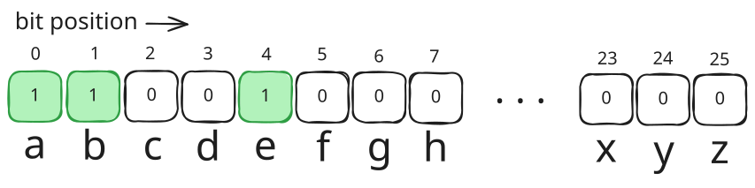

# The Idea
Suppose you need to track a Boolean state for every items in a collection. First idea that comes to mind is to use a hash map:

```go
states := make(map[string]bool)

states["item1"] = true
states["item2"] = false

...
```

This was fine for most data. But if your data has certain set of range, there is a more efficient and faster way to store this: **Bitmask**.

Imagine i have to store the state of appearance of English alphabets in a string:

```go
appears := make(map[rune]bool)

word := "abBCab"

for _, c := range word {
	appears[c] = true
}

...
```

Notice that the range of the data (letters) has the size of 26 (a-z). So instead i can just store it inside a single 32-bit integer as bits (1 for true, 0 for false).

For example, appearances of alphabets inside string "abe" can be stored as: 



To mark letter `'b'` (index 1) as appeared:
```
1 << 1
```

The binary representation would be:
```
0000...00010
```

For letter 'a' (index 0): `1 << 0`   -> `0000...00001` .

For letter 'e' (index 4): `1 << 4`   -> `0000...10000` .

# Implementation

### Storing new value
Suppose we want to store the appearance of letters in a 32-bit integer `appears`. To mark the new character `newChar` as being appeared without clearing the already saved value, we would use bitwise `OR` operator (`|`):
```go
appears |= ( 1 << (newChar - 'a'))
```

Explanation:

- In Go, a rune (character) just an alias of 32-bit integer (int32) for its [Unicode](https://en.wikipedia.org/wiki/Unicode) code point.
- We want the character `'a'` to always reserve the index 0, so subtracting a character with it will return an index relative to it. For Example `'e' - 'a'` would the same as `101 - 97` , therefore will return `4` as we want the character `e` to be stored in index 4
- `1 << index` : shifts a `1` into the index
- `|=` : apply bitwise `OR` in the `appears` variable without disturbing the other bits. For example if the existing bits are `0101`, the operation `0101 |= 0011 will return `0111`

### Counting the data

To count how many "set" bits are in the data (for 32-bit integer):
```go
import(
	"math/bits"
)

...

bits.OnesCount32()

...
```

For example if the stored bits are `01111011` that function will return `6`.

## Case Study
We will implement this technique to solve leetcode [#3120 - Count the Number of Special Characters I](https://leetcode.com/problems/count-the-number-of-special-characters-i).

```markdown
You are given a string `word`. A letter is called "special" if it appears BOTH in lowercase and uppercase in `word`.

Return the number of **special** letters in `word`.

Example 1:
	Input: word = "aaAbcBC"
	Output: 3

	Explanation:
	The special characters in `word` are `'a'`, `'b'`, and `'c'`.

Example 2:
	Input: word = "abc"
	Output: 0

	Explanation:
	No character in `word` appears in uppercase.

Example 3:
	Input: word = "abBCab"
	Output: 1

	Explanation:
	The only special character in `word` is `'b'`.

Constraints:
- 1 <= word.length <= 50
- word consists of only lowercase and uppercase English letters.
```

To solve this problem we have to find a way to store the appearance of each letter, both the lowercase and uppercase versions, inside the `word` to a variable.

### Using hash map 
The common way is to provide hash maps for this:
```go
lower := make(map[rune]bool) 
upper := make(map[rune]bool)

for _, c := range word {
	if c >= 'a' && c <= 'z' { // if it's in the lowercase alphabets range
		lower[c] = true 
	} else { 
		upper[c] = true 
	}
}
```

Then we count the appearance of characters ONLY if the lowercase and uppercase versions of the character has marked true:

```go
count := 0 
for c := range lower { 
	if upper[c-32] { // 'a'-'A' == 32 
		count++ 
	} 
} 
return count
```

### Using bitmask

The structure of the algorithm is similar to the hash map version but we use two `int32` instead of `map`. Then we apply the bitwise insertion as we've discussed in teh previous section:

```go
var lower, upper int32

for _, c := range word { 
	if c >= 'a' && c <= 'z' { 
		lower |= 1 << (c - 'a') 
	} else { 
		upper |= 1 << (c - 'A') 
	} 
}
```

To count the appearance of the "special" characters, we apply bitwise `AND` operator to both `lower` and `upper` then use `bits.OnesCount32` to count the resulting `1`s:

```
return bits.OnesCount32(uint32(lower & upper))
```

Full code:
```go
import(
	"math/bits"
)
func numberOfSpecialChars(word string) int { 
	var lower, upper int32 
	for _, c := range word { 
		if c >= 'a' && c <= 'z' { 
			lower |= 1 << (c - 'a') 
		} else { 
			upper |= 1 << (c - 'A') 
		} 
	} 
	return bits.OnesCount32(uint32(lower & upper)) 
}
```

### Analysis

Why is this better than a map? 


|             | Map                  | Bitmask                      |
| ----------- | -------------------- | ---------------------------- |
| Space       | ~50 bytes per entry  | 8 bytes total (two `int32`s) |
| Lookup      | Hash + pointer chase | Single bit test (`& 1`)      |
| "Count set" | Look over map        | 1 CPU instruction (`POPCNT`) |

For this specific problem, 26 possible letters, Boolean state only, a bitmask is the perfect fit. The technique generalizes to any problem where you're tracking membership across a small, fixed set of items.

## Beyond the 32 slots of states

If our problem requires more than 32 slots to store the states, Go provides some data types we can use:

| Type    | Bits/slots | Use when                                    |
| ------- | ---------- | ------------------------------------------- |
| `int32` | 32         | up to 32 items (r.g. 26 alphabets)          |
| `int64` | 64         | up to 64 items                              |
| uint64  | 64         | same, but `bits.OnesCount64` works directly |

```go
var mask uint64
mask |= 1 << (c - 'a')  // same pattern as before, just bigger
bits.OnesCount64(mask)
```

### Beyond 64 slots

Go's `math/big` package gives you an arbitrary-precision integer, which you can use as an unlimited bitmask:

```go
import "math/big"

mask := new(big.Int)
mask.SetBit(mask, index, 1)  // set bit at position `index`
mask.Bit(index)               // read bit (returns 0 or 1)

// AND two masks
result := new(big.Int).And(maskA, maskB)

// Count set bits
result.OnesCount()  // added in Go 1.24
```

The downside is heap allocation and slower operations, no single CPU instruction anymore (the hardware's `POPCNT`).

For faster data type for 64 slots, use `[]uint64`.

```go
type BitSet []uint64

func NewBitSet(size int) BitSet {
    return make(BitSet, (size+63)/64)  // how many uint64s needed
}

func (b BitSet) Set(i int) {
    b[i/64] |= 1 << (i % 64)   // which chunk, which bit within it
}

func (b BitSet) Get(i int) bool {
    return b[i/64]>>(i%64)&1 == 1
}

func (b BitSet) OnesCount() int {
    count := 0
    for _, word := range b {
        count += bits.OnesCount64(word)
    }
    return count
}
```

This stays fast because each `uint64` chunk still uses the hardware `POPCNT` instruction. This is also what competitive programmers and standard libraries actually use. We manually chunk the bits across multiple `uint64`s.

The `[]uint64` slice approach is also what libraries like [`github.com/bits-and-blooms/bitset`](github.com/bits-and-blooms/bitset) give us, with AND/OR/count already implemented, worth knowing it exists for contest or production use.
