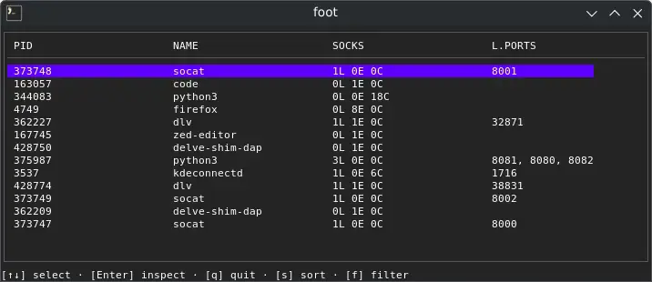

I’ve been hacking on a new side project lately: a Linux TUI tool that shows processes and the sockets they open, all in one place. Think `ps` + `ss` + a bit of *“wait, what is actually listening on this port right now?”* but interactive and terminal-first.

This comes straight from my own experience working on local backend projects. Too many times something refused to start because a port was already taken, and I ended up bouncing between `ss`/`netstat`, `ps`, and pure guesswork. I wanted a single place where I can open a terminal UI, glance at what’s running, drill into a process, see all its sockets, and send signals if needed.

Under the hood, I’m building it in Go, and using a really cool TUI library called [Bubble Tea](https://github.com/charmbracelet/bubbletea). It’s been a fun mix of low-level Linux stuff and UI state management in the terminal.

Still early days:

* UI is coming together
* Data is mostly real, some parts still mocked
* Lots of `/proc` parsing and performance tuning ahead

I decided to name this tool **netps** (netstat + ps, get it? 🤪). Still tentative, though.

Not sure where this will end up yet, could stay a personal tool, could grow into something bigger. For now, it’s just me scratching an itch from real-world backend work and learning a lot along the way.

Will update in the upcoming posts.
