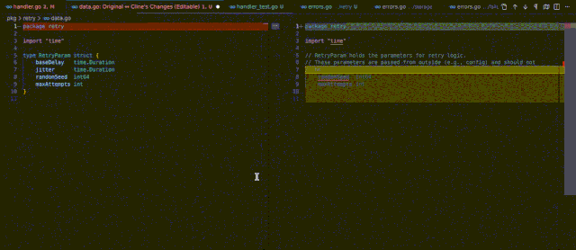

I've been playing around with agentic coding lately, letting an AI work through coding tasks with minimal hand-holding, and recently stumbled onto a setup that's genuinely good and costs nothing to run. This post walks through exactly how I got it working, from zero to a working environment, in about ten minutes.

No paid subscriptions. No API keys to manage. Just a few accounts and one surprisingly capable free model.

---

## But first, what are we even talking about?

Before diving into the steps, let me lay out the key terms, because this space moves fast and the jargon stacks up quickly.

**LLM (Large Language Model)** is the engine behind all of this. It's a type of AI model trained on massive amounts of text, capable of understanding and generating code, answering questions, and reasoning through problems. When people say "AI coding assistant," there's an LLM doing the heavy lifting underneath.

**Inference** is what happens when you actually _use_ an LLM: you send it a prompt (like a coding task), and it generates a response. Each inference costs compute resources, which is why providers typically charge per token (a token is roughly a word or a short chunk of text). Every time Cline asks the model to think or write code, that's an inference happening.

**Context** is everything the model can "see" at any given moment during a conversation: your prompt, the files you've attached, the chat history so far, and any other information fed into it. The model has no memory between separate tasks. It only knows what's inside the current context. This is why feeding it the right files and information matters so much. If it's not in the context, the model doesn't know it exists.

**Context window** is the maximum amount of context a model can hold at once, measured in tokens. Think of it as the model's working memory. If your conversation grows beyond this limit, older parts get dropped. Step 3.5 Flash has a 256,000 token context window, (which is quite generous) but in a long agentic session with many files, it can fill up faster than you'd expect. Cline (which we'll use later shortly) shows you a progress bar for this so you can keep an eye on it.

**Model** in this context refers to a specific LLM you're working with. Different models have different strengths, speeds, and costs. Think of them as different tools in your toolkit: you pick the right one for the job.

**Agentic coding** is the practice of giving an AI model a task  (sometimes a complex, multi-step one) and letting it work through it autonomously: reading files, writing code, running tests, and iterating, with minimal intervention from you. It's less "autocomplete on steroids" and more "I have a junior dev who can actually finish tasks."

**OpenRouter** is a service that acts as a unified gateway to dozens of different LLM providers. Instead of signing up with each AI company separately, you connect to OpenRouter and pick from their catalog of models. Some are paid, some free. It handles routing your requests to the right backend provider. Think of it as an app store, but for AI models.

**Cline** is a VS Code extension that turns your editor into an agentic coding environment. It connects to an LLM (via a provider like OpenRouter) and can autonomously read your codebase, write and edit files, run commands, and iterate on problems. You give it a task, and it works through it step by step.

**StepFun** is a Chinese AI lab (full name: StepFun AI) that develops and open-sources their own family of large language models. Their models have been gaining traction recently due to competitive performance at lower cost.

**Hallucination** is when an LLM generates something that sounds confident and plausible, but is factually wrong or completely made up. In coding, this often shows up as invented function names, incorrect API usage, or logic that looks right at a glance but doesn't actually work. It's one of the more frustrating things you'll run into with weaker models, and one of the quickest ways to tell a good model from a bad one for your use case.

---

## Why this setup works

The key insight here is that OpenRouter occasionally offers certain models on a **free tier**, meaning zero cost per inference. Right now, one of those free models is **Step 3.5 Flash** from StepFun, and it's genuinely good.

Step 3.5 Flash is built on a **Mixture of Experts (MoE)** architecture, a technique where the model has a large total parameter count (196B), but only activates a small subset (11B) for any given task. This makes it fast and efficient. It also has a generous 256,000 token context window, which is more than enough for most coding tasks.

I've been using it for a personal project involving **concurrent Go code with mutex synchronization** and long test scenarios using `--race` flags. For that kind of medium-complexity reasoning, Step 3.5 Flash handled it quite well, and it was noticeably faster than some paid models I tried on OpenRouter like Kimi or MiniMax.

> **A note on "free" models:** Free tiers on OpenRouter can change. StepFun's model is free _right now_, but there's no guarantee it'll stay that way. My advice: take advantage of it while it lasts, and use it as a low-risk way to learn the agentic coding workflow before committing to a paid model later.

---

## The Setup

Here's the full process, start to finish. It should take around 10 minutes.

### Step 1: Create an OpenRouter account and set up billing

Go to [openrouter.ai](https://openrouter.ai/) and sign up for an account.

Once you're in, you'll need to set up billing. OpenRouter uses a **top-up model**: you add credits to your account, and those credits get consumed as you use paid models. Each inference draws down a small amount based on the model's pricing.

**But here's the thing: for our setup, you won't actually be spending credits.** Step 3.5 Flash is on the free tier, so no credits will be deducted. You still need to set up a payment method though. It's a required step to activate your account.

To set up billing, you'll need a credit or debit card. OpenRouter will charge a small authorization hold (a few dollars or less) to verify the card (this is completely standard for any online payment platform, and it will be released back to you. It's not an actual charge).

> **For Indonesian readers:** If you don't have a physical credit/debit card, **Jenius e-card** works perfectly here. It's a virtual card you can set up through the Jenius app. Just make sure you have some balance on it, enough to cover the small authorization hold. Once that clears, you're good to go.

Once billing is set up, you need to create an **API key**. An API key is a unique string that lets other tools, like Cline, authenticate with OpenRouter on your behalf, so they can make requests to the models without you logging in each time. Go to [openrouter.ai/settings/keys](https://openrouter.ai/settings/keys) and create a new key.

You'll see four fields to fill in:

**Name** - just a label for yourself. Something like `cline-personal` works fine.

**Credit Limit** - this caps how much spend this key is allowed before it stops working. For our setup it doesn't matter since Step 3.5 Flash is free, but if you plan to experiment with paid models later, setting a limit here is a good guardrail so you don't accidentally burn through credits. Leave it blank for no limit.

**Reset Limit every...** - if you set a credit limit, this controls how often it resets. Options like daily or weekly are available, all resetting at midnight UTC. If you want a hard total cap that never resets, pick "N/A". If you left the credit limit blank, this doesn't apply.

**Expiration** - when the key should stop working. Pick "No expiration" for a key that stays active indefinitely.

For my setup, I left the credit limit blank and set no expiration, simple and low-maintenance. But again, if you're planning to try paid models down the line, I'd recommend adding a credit limit as a safety net.

**Important: once you create the key, copy it and store it somewhere safe.** OpenRouter will not show it to you again. You'll need it in a later step when configuring Cline.

### Step 2: Download and install Visual Studio Code

If you don't already have it, grab [VS Code](https://code.visualstudio.com/) from the official site. It's free and available for Windows, macOS, and Linux.

### Step 3: Install the Cline extension

Open VS Code, go to the **Extensions** panel (the puzzle piece icon on the left sidebar, or press `Ctrl+Shift+X`), and search for **Cline**.

Install it, then open the extension on the left panel. You'll be prompted "How will you use Cline?", ignore this for now and click "Login to Cline", you'll be prompted to SignUp for Cline account, go ahead and do that. This is just to activate the extension and give it a session history feature. No billing or payment is needed on Cline's side, because we're going to point it at OpenRouter for the actual model.

### Step 4: Configure Cline to use OpenRouter

This is where everything gets connected. Once Cline is installed and activated, click the **gear icon** in the top-right corner of the Cline sidebar to open its settings.

You'll see a configuration form with several fields. Fill them in as follows:

**API Provider**: select `OpenRouter` from the dropdown. This tells Cline to route all model requests through OpenRouter instead of talking to a provider directly.

**OpenRouter API Key**: paste the API key you copied in Step 1 here. This is how Cline authenticates with OpenRouter on your behalf.

**Model**: select or type `stepfun/step-3.5-flash:free`. This is the specific model Cline will use for all your tasks.

**Enable Thinking (1024 tokens)**: check this box. Step 3.5 Flash is a reasoning model, meaning it has the ability to "think" internally before generating its response, working through the problem step by step before writing code. When this is enabled, Cline allocates a budget of 1024 reasoning tokens for that internal thinking process. It can improve the quality of the model's output, especially on trickier tasks. The 1024 token budget is Cline's minimum. It's a small amount and won't noticeably affect performance on the free tier.

Once all the fields are filled in, click the **Done** button at the top of the Cline sidebar. That's it. Cline is now fully wired up to Step 3.5 Flash via OpenRouter.

At the **bottom of the Cline sidebar**, you'll see something like `openrouter:stepfun/step-3.5-flash:free`. This is a model selector. In case you want to change to another model later, you can click on the model selector there.

### Step 5: Try it out

Open a project in VS Code, open the Cline panel, and make sure you're in **Plan mode** (more on that below). Give it a task. Something like:

> _"Add input validation to the user registration function and write unit tests for it."_

The model will read your code, reason through the task, and lay out a plan for you to review before it touches anything. The rest of the workflow (how Plan and Act mode work, how to give it context, and how to keep an eye on your usage) is covered in the next section.

---

## A quick look at the model landscape (for context)

You might wonder why Step 3.5 Flash and not something else. Here's a rough picture of what's out there, some of these I tested through OpenRouter + Cline, others I compared against using a different setup (more on that below):

| Model                     | Provider    | Cost     | Speed    | Good for                                |
| ------------------------- | ----------- | -------- | -------- | --------------------------------------- |
| **Step 3.5 Flash**        | StepFun     | Free     | Fast     | Medium-complexity coding, general tasks |
| **Gemini 2.5 Flash**      | Google      | Paid     | Fast     | Medium-complexity coding                |
| **Claude Sonnet 4.5**     | Anthropic   | Paid     | Moderate | Medium-complexity coding                |
| **Gemini 3**              | Google      | Paid     | Moderate | Complex, multi-step tasks               |
| **Kimi 2.5**              | Moonshot AI | Paid     | Moderate | Complex reasoning, hard problems        |
| **Kimi 2 Thinking**       | Moonshot AI | Paid     | Moderate | Deep reasoning, medium problems         |
| **MiniMax M2.1**          | MiniMax     | Paid     | Moderate | General-purpose tasks                   |
| **GPT-5-Nano**            | OpenAI      | Low cost | Fast     | Lightweight tasks                       |
| **Gemini 2.5 Flash Lite** | Google      | Low cost | Fast     | Lightweight tasks                       |

**Kimi** is developed by Moonshot AI, a Chinese AI startup. Their "Thinking" variants are models tuned for extended reasoning. They take longer but can handle harder problems. 

**MiniMax** is another Chinese AI company with a range of models across different sizes and capabilities. 

**GPT-5-Nano** is OpenAI's smallest, cheapest model in the GPT-5 family, designed to be fast and low-cost for simpler tasks.

**Gemini 2.5 Flash Lite** is Google's budget-tier model from the Gemini 2.5 line, similarly positioned for lightweight, cost-effective inference. 

**Claude Sonnet 4.5** is Anthropic's mid-tier model, solid at coding and reasoning tasks. 

**Gemini 3** is Google's latest flagship model, a step up in capability from the 2.5 line.

I actually tried GPT-5-Nano and Gemini 2.5 Flash Lite before settling on this setup, but on a different tool at the time. I was using **Zed Editor**'s built-in AI coding feature, which lets you connect to various models directly without Cline. For the same level of task I was throwing at Step 3.5 Flash, both GPT-5-Nano and Gemini 2.5 Flash Lite hallucinated noticeably more. They'd generate code that looked reasonable on the surface but used wrong APIs, invented functions that don't exist, or got the logic subtly wrong in ways that only surfaced when you actually ran the tests. Step 3.5 Flash was significantly more reliable for the same kind of work. And again, it's free.

From my experience across both setups, the models roughly shake out into tiers. Step 3.5 Flash sits in the same ballpark as Gemini 2.5 Flash and Claude Sonnet 4.5. All three handled medium-complexity tasks with similar reliability. Above them is a noticeable step up: Gemini 3 and Kimi 2.5 Thinking, which I reached for when tasks got more complex and needed stronger reasoning. So Step 3.5 Flash isn't just "good enough for free", it's actually competitive with paid models at its tier. The question is only whether your tasks eventually outgrow that tier.

For my use case (medium-level reasoning on real codebases) Step 3.5 Flash hit the sweet spot: fast, capable, and free. If you eventually hit its limits on harder tasks, the paid models are worth exploring, but I'd start here.

---

## How I actually use this setup

It's worth setting expectations here. Agentic coding with current LLMs isn't magic. The model will sometimes misunderstand what you want, go down the wrong path, or need a nudge. But the gap between "AI autocomplete" and "AI that can actually work through a task" is real, and Cline's workflow is designed around that gap pretty well. Here's how I use it day to day.

### Plan mode vs Act mode

The single most important thing to understand about Cline is that it has two modes: **Plan** and **Act**. You toggle between them in the **bottom-right corner** of the Cline extension panel.

In **Plan mode**, the model cannot touch your files. It can read them, but it won't write or modify anything. This is where you do the thinking together with the model. You describe what you want, and the model breaks it down into a concrete, sequential plan: the steps it would take to actually execute the task.

This is where the real value is, honestly. Before the model writes a single line of code, you get to look at its plan and say "no, that's wrong, do it this way instead." You can go back and forth with it, refine the plan, poke holes in it. It's like reviewing a design doc before someone starts coding. Only when you're happy with the plan do you move on.

### Giving the model context

The model can only work with what it knows about your project, so feeding it the right context matters. This is one of the things that separates decent results from great ones. If you just type "fix the bug" without pointing the model at the relevant files, it's guessing. Point it at the right files, and suddenly it can actually reason about your code. The difference in output quality is noticeable.

Cline gives you two ways to do this.

The first is the `@` mention. Type `@` in the prompt message box and you can point the model at specific files in your project. If you're working on a bug in `auth/handler.go`, just type `@auth/handler.go` and it'll pull that file into the conversation.

The second is the `+` button at the bottom of the prompt message box. This lets you add external context (things outside your project) that are relevant, like documentation or reference material.

### From plan to execution

Once you're satisfied with the plan, toggle over to **Act mode**. If a plan has already been generated in Plan mode, the model starts executing it immediately, no additional prompt needed. It just goes.

As it works, Cline opens a diff view in your editor that looks like VS Code's built-in git diff, the familiar red and green line-by-line comparison. The title bar will say **"Cline's Changes"** so you know what you're looking at. You can watch the model's progress in real time as it edits files.

### Approvals and permissions

Here's an important detail: **the model can't save anything without your say-so.** After it makes changes to a file, Cline will prompt you to review and click **Save** to confirm. This is by design, you're the last checkpoint before anything actually gets written to disk.

The same applies to running commands. If the model wants to execute something on the command line (like running tests), it'll ask for your approval first before doing so.

That said, if you find yourself clicking Save on every single small change and it's slowing you down, you can adjust this. At the top of the prompt message box, there's an **Auto-approve** setting. You can configure which actions the model is allowed to do without asking. Saving files, running specific commands, and so on. I'd recommend keeping it conservative when you're starting out, and loosening it once you get a feel for how the model behaves.

### Watching your token usage and cost

At the very top of the Cline extension, you'll see a **progress bar** showing your context usage for the current task. This tracks the total tokens consumed, both input (what you and the model have said) and output (what the model has generated), against the maximum context window allowed by the model. For Step 3.5 Flash, that's 256K tokens.

This bar **resets every time you start a new task**, so each conversation in Cline is its own isolated session.

Right above that bar, there's a **cost counter** showing how many dollars the current task has consumed on OpenRouter. For Step 3.5 Flash it'll stay at $0.00, but this becomes very useful once you start experimenting with paid models. It's the fastest way to keep an eye on your spend without having to log into OpenRouter every time.

### `.clinerules` — giving the model standing instructions

One last thing that's made a big difference in my workflow: the `.clinerules` file. Place a file named exactly `.clinerules` in the **root directory** of your project, and whatever you write in it becomes a standing instruction that the model reads at the start of every task. It has to be in the root, as subdirectories won't work.

Think of it like a README for the AI. You can put anything there that you'd otherwise have to repeat every time: coding style preferences, project conventions, things to avoid, testing requirements. For example:

- Always use table-driven tests for Go code  
- Never modify go.mod unless explicitly asked  
- When writing mutex code, always pair Lock() with defer Unlock()  
- Run go vet before finishing any task

This is similar in spirit to `AGENTS.md` (used by some other AI coding tools) or Claude's project-level instructions. It's just Cline's version of the same idea.

### When the model isn't enough

One thing I appreciated about Cline: it's upfront when it thinks you might be hitting the limits of your chosen model. When I threw a more complex task at it recently, Cline popped up with this warning:

> _Cline uses complex prompts and iterative task execution that may be challenging for less capable models. For best results, it's recommended to use Claude 4 Sonnet for its advanced agentic coding capabilities._

It's a helpful nudge. It doesn't stop you from continuing. You can ignore it and keep going, but it's a signal that the task might be too heavy for the current model and you might want to swap to something more capable. If you start seeing this, it's worth considering whether to switch to a stronger (paid) model for that particular task. For the medium-complexity stuff Step 3.5 Flash handles well, you won't see it.

### Putting it all together

The workflow I've settled into looks something like this: open a project, drop in some context with `@`, describe the task in Plan mode, review and tweak the plan until it looks right, toggle to Act, watch it work, approve the changes, and move on. For my personal project (go concurrency, mutex synchronization, long test scenarios with `--race` flags) Step 3.5 Flash would often nail the structure on the first or second pass. That's the kind of productivity gain that makes this whole setup worth the ten minutes it took to get running.

---

## Recap

1. Sign up on OpenRouter, set up billing, and create an API key (no actual spend needed for our setup)
2. Install VS Code if you haven't already
3. Install Cline from the VS Code extensions, create an account
4. Configure Cline: set OpenRouter as the provider, paste your API key, select `stepfun/step-3.5-flash:free`, enable thinking
5. Start giving it tasks and see how it goes

The whole point of this post is to lower the barrier. You don't need a paid subscription, you don't need to understand the internals of how LLMs work, and the setup itself is straightforward. Just a few accounts and a handful of fields to fill in. Just follow these steps and you're coding with an AI agent in minutes.

Give it a shot while Step 3.5 Flash is free. And if you want to share how it goes, or what models you end up preferring. I'm always curious to hear.

Thank's for reading, and happy coding!

